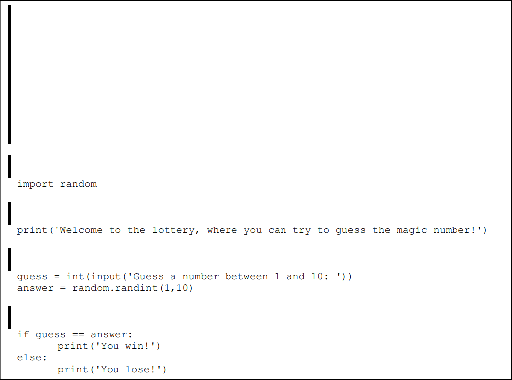

# commenting

Comments are a way of writing human-readable descriptions of your code, for yourself and anyone else who may read your code in the future. These lines are specifically *ignored* by the computer when running your code. They are vital not only after-the-fact, but also in structuring your thinking while you program. **Every** program you write should have thorough comments.

There are [three types of comments](https://www.python.org/dev/peps/pep-0008/#comments) in Python:

1. **Block:** Starts with a `#` on a new line, and describes the following block of code (usually 3-5 lines, separated with a blank line and a new block comment).

2. **Inline:** Like a block comment, starts with a `#` but on the *same line* as code. Use these sparingly - it is almost always better to use a block comment.

3. **[Docstring](https://www.python.org/dev/peps/pep-0257/#what-is-a-docstring):** A multi-line comment that starts and ends with `"""`, used to describe an entire file or function. Every file should start with a docstring.

Comments should be written **as sentences**, with a capital letter and a period.

#### Demonstration

In the code below, there is an example of each type of comment:

```python
"""
Docstring:
Describe the entire file/function, in broad terms,
over multiple lines.
"""

# Block comment: Describe the following block of code.
x = 1
x = x + 1.05    # Inline comment: Describe something unique on this line.
print(x)

# Another block comment.
y = 2
print(y)
```

#### Removing code

Note that comments can also be used to temporarily remove code, like below:

```python
# Set the difficulty of the game.
# difficulty = 'hard'
difficulty = 'easy'
```

## Paper exercises

You will be given paper exercises to test your ability to use comments and your understanding when reading code excerpts. These exercises will **always** require you to:

1. Add a *Docstring* to the top of the excerpt, with the following layout (replace `[...]` with the appropriate information):

    ```python
    """
    File: [program name.py]
    Name: [Your Name]
    Date: [Date the program was written]
    Desc: [Brief, 1-sentence description.]
    """
    ```

2. Add one or more *Block Comments* at the lines indicated with black "gutter marks".

    - These should describe the block of code that follows them.

3. You will not be asked to add *Inline Comments* to any code.

## Examples

For each code excerpt below, read the code and add appropriate docstrings and block comments. In the docstring, use your own name as the author, provide your own description of the code, and use the filename and date provided.

1. `hellouser.py` (March 18, 2018):

    

2. `lottery.py` (March 18, 2018):

    
